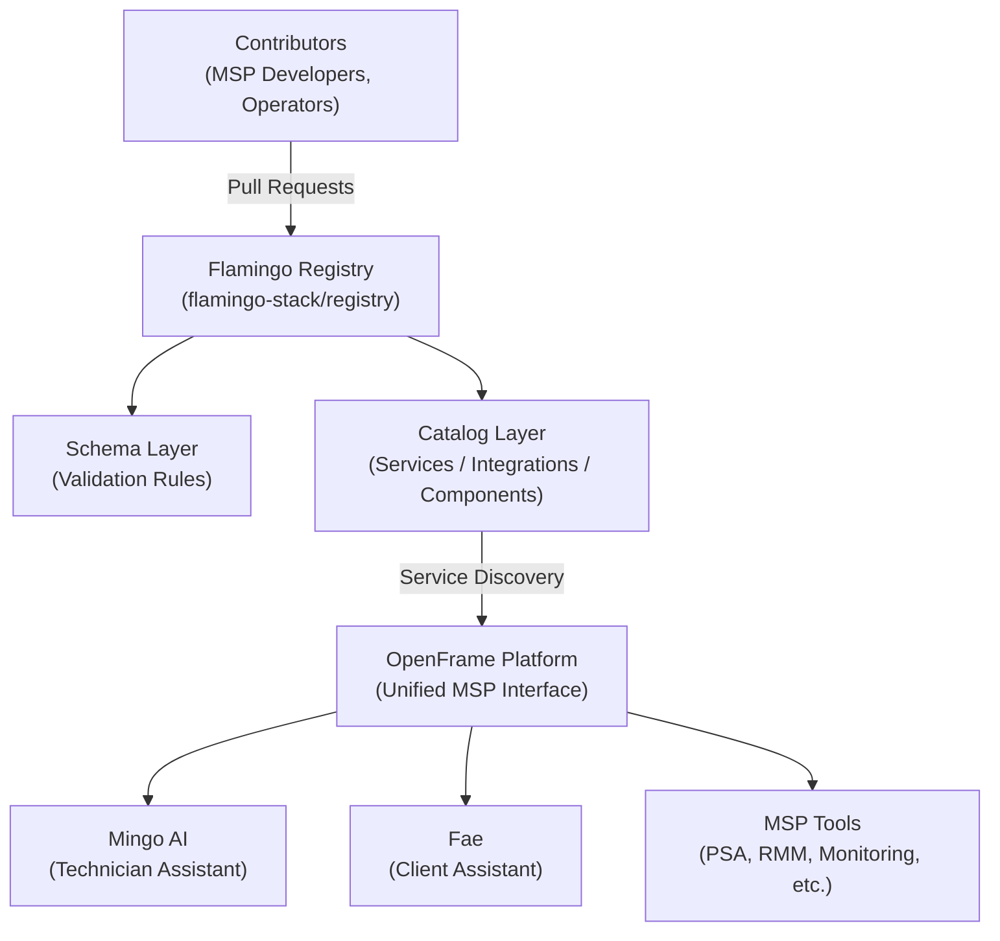

<div align="center">
  <picture>
    <source media="(prefers-color-scheme: dark)" srcset="https://shdrojejslhgnojzkzak.supabase.co/storage/v1/object/public/public/doc-orchestrator/logos/1771371901777-lc3cse-logo-openframe-full-dark-bg.png">
    <source media="(prefers-color-scheme: light)" srcset="https://shdrojejslhgnojzkzak.supabase.co/storage/v1/object/public/public/doc-orchestrator/logos/1771372526604-k3y1w-logo-openframe-full-light-bg.png">
    
  </picture>
</div>

<p align="center">
  <a href="LICENSE.md"></a>
</p>

# Flamingo Registry

The **Flamingo Registry** is the central catalog and discovery hub for services, integrations, and components within the [Flamingo](https://flamingo.run) / [OpenFrame](https://openframe.ai) ecosystem. It is an open-source, content-first repository that acts as the **source of truth** for discovering, versioning, and referencing the building blocks that power AI-driven MSP (Managed Service Provider) operations.

Think of it as the **package index and service catalog** for the OpenFrame platform — a machine-readable, Git-native directory that every part of the platform reads from.

## Features

- **Service Discovery** — Centralized lookup for all OpenFrame platform components, integrations, and reusable building blocks
- **Version Catalog** — Tracks releases and compatibility metadata for every registered entry using semantic versioning
- **Open Source** — Community-driven and extensible under the Flamingo Stack; contributions welcome via pull request
- **AI-Ready** — Designed for direct consumption by Mingo AI (technician assistant) and Fae (client assistant)
- **MSP-Native** — Built around Managed Service Provider workflows — PSA, RMM, monitoring, ticketing, and more
- **Kubernetes-Style Resource Model** — Familiar `apiVersion / kind / metadata / spec` schema structure for platform engineers
- **Schema Validation** — Every catalog entry is validated against a JSON/YAML schema, enforcing quality in CI before merge
- **Auditable by Design** — Git-native, PR-based model provides a complete, reviewable change history for the catalog

## Architecture

The Registry sits at the center of the OpenFrame service mesh — every component that participates in the platform is registered here.



### Catalog Structure

The catalog is organized by entry type:

| Directory | What It Contains |
|---|---|
| `catalog/services/` | OpenFrame platform service definitions |
| `catalog/integrations/` | Third-party MSP tool integrations (PSA, RMM, monitoring, etc.) |
| `catalog/components/` | Reusable platform building blocks and libraries |
| `schemas/` | Validation schemas for all entry types |
| `docs/` | Documentation for contributors and operators |

### Entry Format

Every catalog entry follows a Kubernetes-style resource definition:

```yaml
apiVersion: registry.flamingo.run/v1
kind: Service | Integration | Component
metadata:
  name: my-integration          # kebab-case, globally unique
  version: "1.0.0"              # semantic versioning
  description: "Description"
  labels:
    category: psa               # psa, rmm, monitoring, security, etc.
    vendor: acme-corp
spec:
  homepage: "https://vendor.example.com"
  documentation: "https://docs.vendor.example.com"
  maintainers:
    - name: Your Name
      contact: "https://www.openmsp.ai/"
```

## Quick Start

No build step required — the Registry is a content-first data repository.

### Prerequisites

| Tool | Purpose |
|---|---|
| **Git 2.x+** | Cloning and contributing |
| **yamllint** | YAML syntax validation |
| **jq** | JSON schema inspection |

### 1. Clone the Repository

```bash
git clone https://github.com/flamingo-stack/registry.git
cd registry
```

### 2. Explore the Catalog

```bash
# List registered services
ls catalog/services/

# List integrations
ls catalog/integrations/

# Inspect an entry
cat catalog/services/<entry-name>.yaml
```

### 3. Add a New Registry Entry

```bash
# Copy an existing entry as a template
cp catalog/integrations/example-integration.yaml catalog/integrations/my-integration.yaml

# Edit with your details
code catalog/integrations/my-integration.yaml
```

### 4. Validate Your Entry

```bash
# Check YAML syntax
yamllint catalog/integrations/my-integration.yaml

# Check for duplicate names
grep -r "name: my-integration" catalog/
```

### 5. Commit and Open a Pull Request

```bash
git checkout -b feat/add-my-integration
git add catalog/integrations/my-integration.yaml
git commit -m "feat(integrations): add my-integration entry"
git push origin feat/add-my-integration
```

Then open a Pull Request at [https://github.com/flamingo-stack/registry/pulls](https://github.com/flamingo-stack/registry/pulls).

## Technology Stack

| Layer | Technology |
|---|---|
| **Catalog format** | YAML (human-readable entries) |
| **Schema format** | JSON Schema (machine-readable validation) |
| **Version control** | Git / GitHub |
| **Validation** | yamllint, JSON Schema validators |
| **CI/CD** | GitHub Actions (automated validation on every PR) |
| **Entry model** | Kubernetes-style resource definitions |

## Documentation

📚 See the [Documentation](./docs/README.md) for comprehensive guides including getting started tutorials, development setup, architecture overview, security guidelines, and contributing workflows.

## Community and Support

All support and discussion happens on the **OpenMSP Slack community** — we do not use GitHub Issues or GitHub Discussions.

- **OpenMSP Slack**: [https://www.openmsp.ai/](https://www.openmsp.ai/)
- **Join the community**: [Slack invite link](https://join.slack.com/t/openmsp/shared_invite/zt-36bl7mx0h-3~U2nFH6nqHqoTPXMaHEHA)
- **Flamingo Platform**: [https://flamingo.run](https://flamingo.run)
- **OpenFrame Platform**: [https://openframe.ai](https://openframe.ai)

## Contributing

Contributions are welcome! See [CONTRIBUTING.md](./CONTRIBUTING.md) for the full contribution guide, including naming conventions, branch strategy, commit message format, and the PR review process.

---

<div align="center">
  Built with 💛 by the <a href="https://www.flamingo.run/about"><b>Flamingo</b></a> team
</div>
