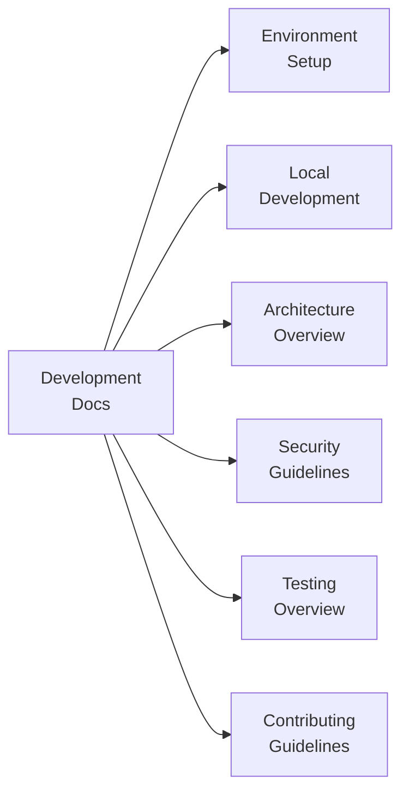

# Development Documentation

Welcome to the development section of the **Flamingo Registry**. This section covers everything you need to contribute to the registry, understand its architecture, and follow best practices for security, testing, and collaboration.

## Overview

The Flamingo Registry is an open-source catalog repository within the [OpenFrame](https://openframe.ai) platform ecosystem. Contributing to it means adding, updating, or validating structured data entries (services, integrations, components) that power the MSP automation platform.

## Documentation Index

| Guide | Description |
|---|---|
| [Environment Setup](setup/environment.md) | IDE setup, recommended tools, and editor configuration |
| [Local Development](setup/local-development.md) | Cloning, running locally, and validating changes |
| [Architecture Overview](architecture/README.md) | How the registry is structured and how it fits in the platform |
| [Security Guidelines](security/README.md) | Secrets management, access control, and secure contribution patterns |
| [Testing Overview](testing/README.md) | How to validate registry entries and run checks |
| [Contributing Guidelines](contributing/guidelines.md) | Code style, branching, commit messages, and PR process |

## Quick Navigation

## Who Should Read This Section?

| Audience | Relevant Guides |
|---|---|
| **First-time contributors** | Environment Setup → Local Development → Contributing Guidelines |
| **Platform operators** | Architecture Overview → Security Guidelines |
| **CI/CD maintainers** | Testing Overview → Local Development |
| **Security reviewers** | Security Guidelines → Contributing Guidelines |

## Getting Help

All support and discussion happens on the **OpenMSP Slack community**:

- Join: [https://www.openmsp.ai/](https://www.openmsp.ai/)
- Invite: [https://join.slack.com/t/openmsp/shared_invite/zt-36bl7mx0h-3~U2nFH6nqHqoTPXMaHEHA](https://join.slack.com/t/openmsp/shared_invite/zt-36bl7mx0h-3~U2nFH6nqHqoTPXMaHEHA)

The repository is hosted at: [https://github.com/flamingo-stack/registry](https://github.com/flamingo-stack/registry)
