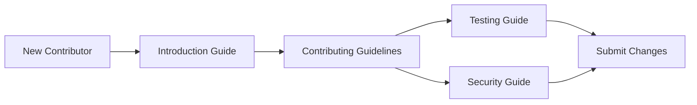

# Development

This section is the starting point for anyone contributing code, tests, or review-process changes to the `flamingo-stack/registry` repository. It brings together the guides that describe how to build, test, secure, and contribute to the project.

> **Note:** The repository graph currently reports no published packages, upstream dependencies, or downstream consumers for this repository, and no `package.json` or `pom.xml` was found during indexing. The development guides below focus on process and practices; refer to your environment configuration for any project-specific build tooling not yet reflected in the indexed material.

## Overview

The development documentation covers everything you need to work on this codebase day to day:

- How changes are tested before merge
- How security is handled during development
- The guidelines contributors are expected to follow
- Where to go first if you are new to the project

Each topic lives in its own guide so you can jump directly to what you need.

## Development Documentation

| Guide | Description |
|---|---|
| [Testing](./testing/README.md) | How tests are organized and run in this repository. |
| [Security](./security/README.md) | Security practices and considerations for development work. |
| [Contributing Guidelines](./contributing/guidelines.md) | Expectations and process for submitting changes. |

## Quick Navigation

- **New to the project?** Start with the [Introduction](../getting-started/introduction.md) to understand what Registry is and how it fits into the broader Flamingo/OpenFrame ecosystem before diving into development work.
- **Writing or running tests?** Go to [Testing](./testing/README.md).
- **Handling sensitive data or reviewing security-relevant changes?** Go to [Security](./security/README.md).
- **Preparing a contribution?** Read the [Contributing Guidelines](./contributing/guidelines.md) before opening any changes.

## Working With This Repository

Since there is no Github Issues or Github Discussions workflow for this project, all community discussion, questions, and coordination happen on the OpenMSP Slack community rather than in-repository threads. Keep this in mind when planning contributions: process and coordination details belong in the [Contributing Guidelines](./contributing/guidelines.md), not in issue trackers.

Use this page as the map for development work in this repository: each linked guide goes into depth on its own topic, and this overview stays the single entry point for navigating between them.
