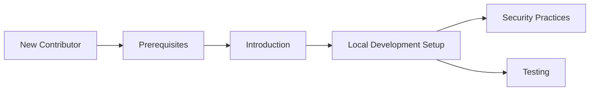

# Development

This section is the entry point for everyone working on the code in the `flamingo-stack/registry` repository. It brings together environment setup, security practices, and testing guidance in one place so you can find what you need without digging through the whole repository.

> **Note:** The repository graph currently reports this repository's role, published artifacts, and dependency edges as unrecorded. If you are integrating Registry with another Flamingo Stack service, confirm the actual dependency and consumption relationships directly with the team rather than assuming any are documented here.

## Overview

The development documentation is organized so that you can go from "I just cloned the repo" to "I understand how to work here safely and correctly" in a few focused steps:

1. **Environment setup** — getting your local machine ready to build and run the project.
2. **Security practices** — the conventions and safeguards expected of any change made to this repository.
3. **Testing** — how changes are verified before they are merged.

Each of these lives in its own document, linked below, so you can jump straight to the topic you need.

Before diving into development-specific docs, make sure you have already reviewed the general onboarding material:

- [Introduction](../getting-started/introduction.md) — what the project is and how it fits into the broader Flamingo Stack.
- [Prerequisites](../getting-started/prerequisites.md) — what you need installed and configured before you start.

## Quick Navigation

| Topic | Description | Link |
|---|---|---|
| Local Development Setup | Steps to configure and run the project locally | [Local Development](./setup/local-development.md) |
| Security | Security practices and expectations for contributors | [Security](./security/README.md) |
| Testing | How to run and write tests for this repository | [Testing](./testing/README.md) |

## How to Use This Section

- **New to the repository?** Start with [Local Development](./setup/local-development.md) to get a working environment.
- **Preparing a change for review?** Check [Security](./security/README.md) for the practices expected of any contribution, and [Testing](./testing/README.md) for how to validate your work.
- **Looking for background on the project itself?** Head back to [Introduction](../getting-started/introduction.md) and [Prerequisites](../getting-started/prerequisites.md) in the Getting Started section.

> This repository does not use GitHub Issues or GitHub Discussions for coordination. Questions, proposals, and community discussion happen on the OpenMSP Slack community.

## Contributing Questions and Community

If you run into something not covered by the documents above, the project does not track discussion through GitHub Issues or Discussions. Instead, reach out through the OpenMSP community:

- OpenMSP website: [https://www.openmsp.ai/](https://www.openmsp.ai/)
- OpenMSP Slack: [https://join.slack.com/t/openmsp/shared_invite/zt-36bl7mx0h-3~U2nFH6nqHqoTPXMaHEHA](https://join.slack.com/t/openmsp/shared_invite/zt-36bl7mx0h-3~U2nFH6nqHqoTPXMaHEHA)

For general product context, see the Flamingo platform at [https://flamingo.run](https://flamingo.run) and OpenFrame at [https://openframe.ai](https://openframe.ai).
