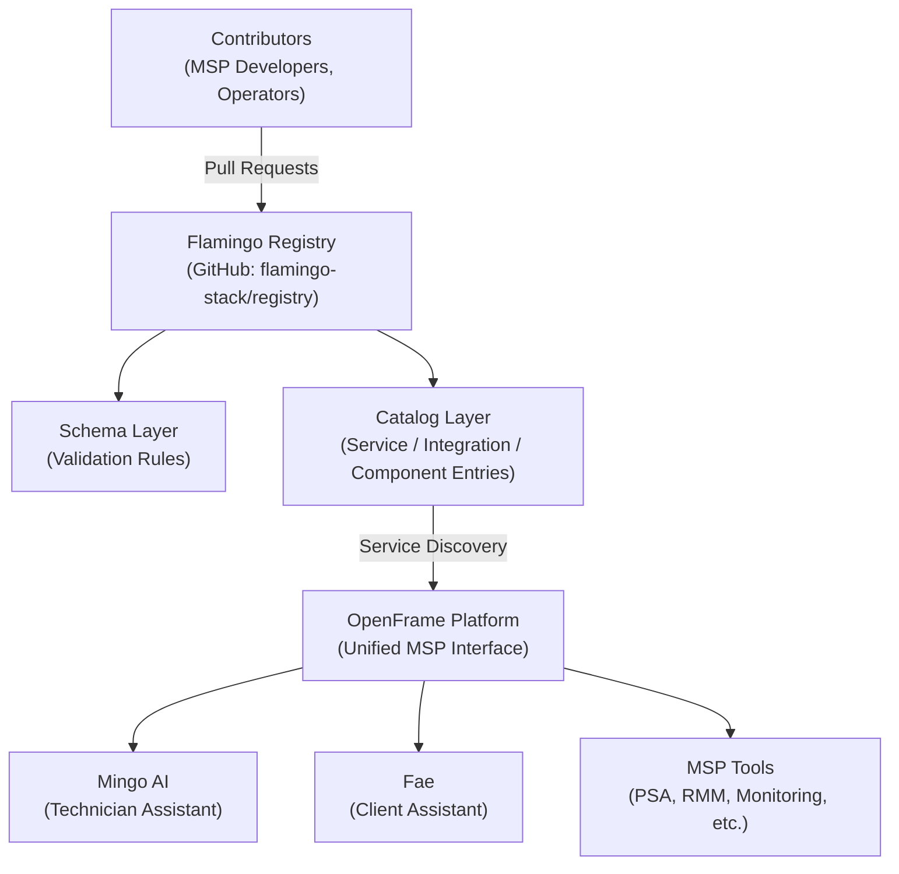
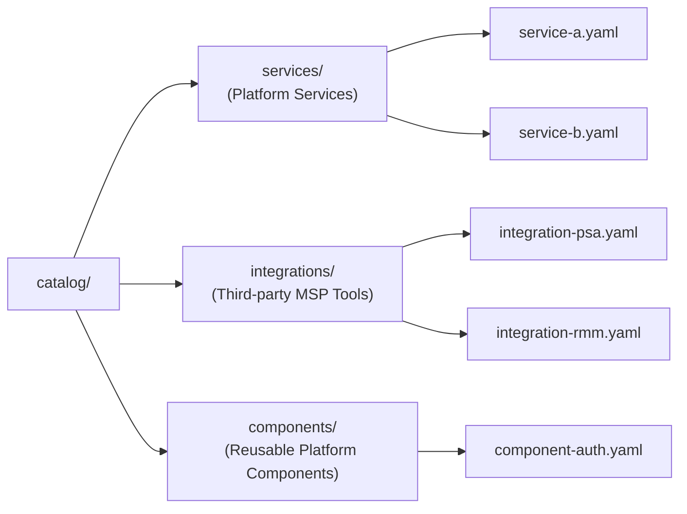
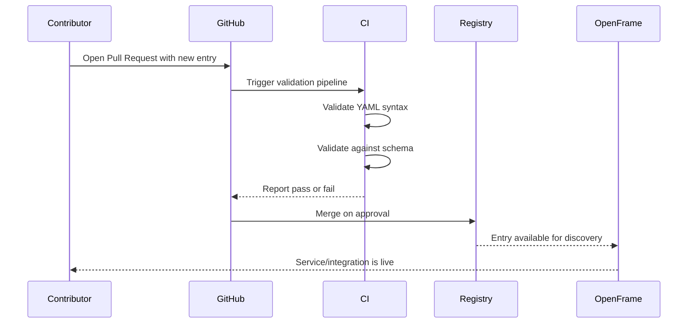
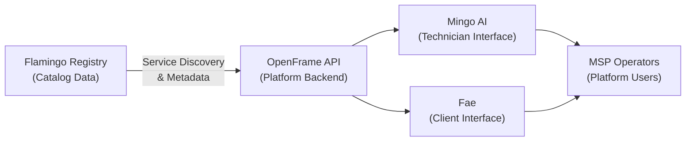

# Architecture Overview

This document describes the architecture of the **Flamingo Registry** and how it fits within the broader [OpenFrame](https://openframe.ai) MSP platform ecosystem.

## High-Level Architecture

The Flamingo Registry is a **content-first catalog repository** — it stores structured definitions of services, integrations, and components as version-controlled data files. These definitions are consumed by the OpenFrame platform, its AI assistants, and downstream CI/CD tooling.



## Core Components

| Component | Location | Purpose |
|---|---|---|
| **Catalog** | `catalog/` | The primary content layer — YAML/JSON definitions of registered entries |
| **Schemas** | `schemas/` | Validation schemas ensuring catalog entries are well-formed |
| **Docs** | `docs/` | Human-readable guides for contributors and operators |
| **CI Validation** | (CI pipeline) | Automated checks that validate entries against schemas on every PR |

## Catalog Structure

The catalog is organized by entry type:



### Entry Types

| Kind | Description | Example Use Case |
|---|---|---|
| `Service` | A platform service provided by OpenFrame | API gateway, notification service |
| `Integration` | A third-party MSP tool integration | ConnectWise, Autotask, Datto |
| `Component` | A reusable building block | Auth module, logging library |

## Data Flow

When a contributor adds a new registry entry, the following sequence occurs:



## Registry Entry Schema

Every catalog entry follows a common metadata structure, inspired by Kubernetes-style resource definitions:

```yaml
apiVersion: registry.flamingo.run/v1   # Schema version
kind: Service | Integration | Component # Entry type
metadata:
  name: string                          # Unique identifier
  version: semver                       # Semantic version
  description: string                   # Human-readable description
  labels:                               # Arbitrary key-value tags
    category: string
    vendor: string
spec:                                   # Entry-specific configuration
  # Varies by `kind`
```

This pattern provides:

- **Consistency** — All entries share a common structure
- **Extensibility** — `spec` is flexible per entry type
- **Discoverability** — Labels enable filtering and search
- **Versioning** — Semantic versions track entry lifecycle

## Integration with OpenFrame Platform



The OpenFrame platform reads the registry to:

1. **Discover available integrations** — what MSP tools are supported
2. **Resolve service dependencies** — what components a workflow needs
3. **Configure AI assistants** — what context Mingo AI and Fae can access
4. **Validate tenant configurations** — ensure requested services exist in the registry

## Key Design Decisions

| Decision | Rationale |
|---|---|
| **Git-native, file-based catalog** | Version control provides auditability, PR-based review, and a clear change history |
| **YAML over JSON for entries** | YAML is more human-readable for catalog maintainers; JSON is used for machine-readable schemas |
| **Kubernetes-style resource model** | Familiar to platform engineers; enables future tooling compatibility |
| **Schema validation in CI** | Prevents invalid entries from reaching the catalog; enforces quality without a runtime |
| **Open pull request model** | Community-driven catalog growth with maintainer oversight |

## Future Architecture Considerations

As the platform grows, the registry may evolve to include:

- A **REST API layer** for programmatic entry submission and querying
- **GraphQL endpoint** for flexible catalog queries
- **Webhook notifications** when entries are added or updated
- **OCI artifact publishing** for distributing registry content as container images

---

> For details on contributing entries, see [Contributing Guidelines](../contributing/guidelines.md). For security considerations around the registry, see [Security Guidelines](../security/README.md).
