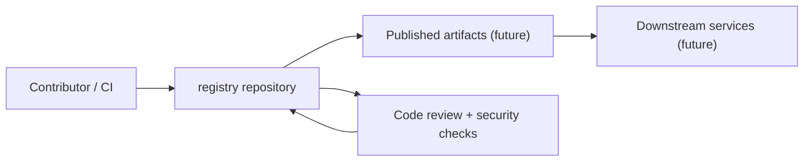

# Security

This document describes the security posture, patterns, and practices for the `flamingo-stack/registry` repository, part of the [Flamingo](https://flamingo.run) / [OpenFrame](https://openframe.ai) ecosystem. It is written for contributors and operators who build, deploy, or review changes to this repository.

> **Ground-truth note:** the repository graph currently reports no published packages, no upstream dependencies, no downstream consumers, and no indexed source, package manifest (`package.json`), or build file (`pom.xml`) for this repository. Coverage is `full`, meaning every other managed repository in the organization has a fresh graph — so the absence of consumers or dependencies here is confirmed, not a gap in visibility. Where implementation specifics (frameworks, code paths, dependency versions) are not yet present in the indexed material, this document states the applicable policy and practice instead of inventing file paths or code that do not exist in the repository.

## Table of Contents

- [Security Model Overview](#security-model-overview)
- [Authentication and Authorization](#authentication-and-authorization)
- [Data Encryption and Secure Storage](#data-encryption-and-secure-storage)
- [Input Validation and Sanitization](#input-validation-and-sanitization)
- [Common Vulnerabilities and Mitigations](#common-vulnerabilities-and-mitigations)
- [Security Testing and Code Review](#security-testing-and-code-review)
- [Environment Variables and Secrets Management](#environment-variables-and-secrets-management)
- [Reporting a Security Issue](#reporting-a-security-issue)

---

## Security Model Overview

Flamingo's overall security philosophy separates two concerns:

1. **Self-hosted OpenFrame deployments** — customer data stays entirely under customer control. Flamingo AI does not access or collect data from self-hosted infrastructure.
2. **Community/shared services (e.g., OpenMSP)** — Flamingo AI collects only the minimum account and content data needed to operate the community knowledge base, plus operational metadata (such as IP addresses and logs) for security, fraud prevention, and moderation.

For this repository specifically, treat any registry contents (manifests, images, packages, or configuration it stores or serves) as part of the trust boundary a downstream deployer relies on. Because the repository graph shows no current published artifacts or consumers, apply the practices below proactively as the repository's surface area grows, rather than retrofitting them later.

> **Note:** the boxes above represent the intended flow for a registry-style repository once it publishes artifacts and gains consumers. Today, `get_repo_ecosystem` reports no published packages and no downstream consumers for `flamingo-stack/registry`.

---

## Authentication and Authorization

Registries and artifact stores are high-value targets: they sit between developers and every environment that consumes what they publish. Regardless of the specific framework used, apply these patterns consistently:

- **Authenticate every write path.** Publishing, tagging, or deleting an artifact must require an authenticated identity — never an anonymous or shared credential.
- **Separate read and write authorization.** Read access (pulling artifacts) and write access (pushing/publishing) should be authorized independently, so a compromised read-only token cannot be used to publish malicious content.
- **Prefer short-lived, scoped tokens over long-lived static credentials.** Scope tokens to the minimum set of namespaces, repositories, or actions required.
- **Enforce the principle of least privilege for automation.** CI/CD pipelines that publish to this registry should use a dedicated service identity with only the permissions needed for the publish step, not a personal or administrative account.
- **Audit authorization decisions.** Log who published what, when, and from where, so that access can be reviewed after the fact.

> Because this repository has no indexed authentication or authorization source files yet, do not assume any specific auth library or middleware is present. When implementing or reviewing authentication code here, verify the actual mechanism in the code under review rather than relying on patterns from other repositories in the organization.

---

## Data Encryption and Secure Storage

- **Encrypt data in transit.** All network communication to and from the registry (publishing, pulling, administrative API calls) must use TLS. Never fall back silently to plaintext transport.
- **Encrypt sensitive data at rest** where the registry stores credentials, tokens, or private artifact contents.
- **Do not store secrets in artifact metadata, tags, or commit history.** Once a secret is committed or published, treat it as compromised and rotate it — history rewriting does not fully remediate exposure once content has been fetched by any client.
- **Customer-controlled deployments remain customer-controlled.** For self-hosted OpenFrame deployments, Flamingo AI does not access or collect customer data; the responsibility for at-rest encryption of self-hosted storage belongs to the deploying organization's own infrastructure controls.
- **Support/diagnostic data is temporary.** If logs or diagnostic data are ever shared voluntarily for troubleshooting, they should be deleted promptly after resolution rather than retained indefinitely.

---

## Input Validation and Sanitization

Any component that accepts external input — artifact uploads, manifest files, API requests, webhook payloads, or search queries — must validate that input before acting on it:

- **Validate structure and type** before parsing (e.g., reject malformed manifests early rather than passing them deeper into the system).
- **Use allow-lists, not block-lists**, for accepted formats, file extensions, and content types wherever the registry accepts uploads.
- **Treat all artifact content as untrusted** until it has passed validation, even when it originates from an authenticated publisher — authentication proves identity, not that the payload is safe.
- **Sanitize anything rendered back to a UI or CLI.** Names, tags, and descriptions that are later displayed must be escaped appropriately for their output context (HTML, terminal, JSON) to prevent injection.
- **Bound resource consumption.** Validate size limits, nesting depth, and count limits on inputs to avoid denial-of-service via oversized or deeply recursive payloads.

---

## Common Security Vulnerabilities and Mitigations

| Vulnerability class | Typical risk in a registry-style service | Mitigation |
|---|---|---|
| Broken authentication | Anonymous or weak credentials allow unauthorized publish/delete | Require authenticated, scoped credentials for all write operations |
| Broken access control | Read tokens reused for write actions, or missing per-namespace checks | Enforce least-privilege, namespace-scoped authorization on every request |
| Injection | Unsanitized artifact metadata or query parameters reach a database or shell | Validate and parameterize all inputs; never build queries or commands via string concatenation |
| Sensitive data exposure | Secrets committed to source, or leaked via verbose logs/error messages | Keep secrets out of source control; scrub logs of credentials and tokens |
| Supply-chain / dependency risk | Malicious or vulnerable dependencies pulled in transitively | Track and review dependency versions; do not add dependencies without checking their provenance |
| Insecure deserialization | Unsanitized package/manifest formats executed or expanded blindly | Parse with strict, schema-validated deserializers; never `eval` or execute artifact content |
| Server-side request forgery (SSRF) | Registry fetches remote URLs supplied by a caller (e.g., mirroring) | Validate and restrict outbound destinations; block internal/link-local address ranges |
| Insufficient logging & monitoring | Abuse goes undetected | Log authentication decisions, publish events, and failures for later review |

> These are general, widely applicable mitigations for registry/artifact-serving systems. Because no source files are currently indexed for this repository, always confirm the actual implementation in code review rather than assuming a specific vulnerability class applies.

---

## Security Testing and Code Review Guidelines

- **Treat every change that touches authentication, authorization, storage, or input parsing as security-relevant** and request explicit review attention on those lines, not just a general approval.
- **Review third-party dependencies before adding them.** Confirm the dependency is actively maintained and does not introduce known vulnerabilities.
- **Never approve code that logs secrets, tokens, or credentials**, even at debug level.
- **Prefer automated checks over manual memory.** Where the repository has CI in place, security-relevant checks (dependency scanning, static analysis, secret scanning) should run on every pull request rather than being applied ad hoc.
- **Test negative paths, not just happy paths.** Security tests should include malformed input, unauthorized callers, expired/invalid tokens, and boundary/size-limit cases.
- **Do not merge disabled or bypassed security checks "temporarily."** If a check must be skipped, document why in the pull request description and follow up promptly.

Follow the general contribution and testing conventions of the repository when adding these checks — see the [contributing guidelines](../contributing/guidelines.md) and [testing guide](../testing/README.md) for the repository's expected pull request and test workflow.

---

## Environment Variables and Secrets Management

- **Never commit secrets, API keys, tokens, or credentials to source control**, including in configuration files, test fixtures, or commit messages.
- **Use environment variables for configuration that differs by deployment** (endpoints, feature flags, credentials), and keep example/template files free of real values.
- **Reference environment variables safely in documentation and scripts.** In shell commands, wrap variable names in backticks when discussing them in prose, for example: set `$REGISTRY_TOKEN` before running a publish command, rather than embedding the literal token in a script.
- **Rotate any credential immediately if it is ever exposed** — in a log, a public branch, or a shared artifact — rather than assuming exposure was harmless.
- **Scope tokens narrowly.** A CI token used to publish to this registry should not also carry administrative rights over unrelated services.
- **Keep support and diagnostic data temporary.** If credentials or environment values are captured in logs shared for troubleshooting, delete them promptly after the issue is resolved.

For the general local environment and configuration setup used across the Flamingo/OpenFrame development workflow, see the [environment setup guide](../setup/environment.md) and [local development guide](../setup/local-development.md).

---

## Reporting a Security Issue

This organization does not use GitHub Issues or GitHub Discussions for coordination — all community discussion happens on the OpenMSP Slack community. If you believe you have found a security vulnerability affecting Flamingo AI products (including this repository, OpenFrame, or OpenMSP), do not open a public issue or discuss it in a public channel.

Contact the privacy and security team directly:

- **Security/privacy inquiries:** privacy@flamingo.so
- **General information:** info@flamingo.so

For broader community discussion (non-security), the organization coordinates through the OpenMSP Slack community: https://www.openmsp.ai/

> Customers and self-hosted deployers remain solely responsible for the security of their own infrastructure. Flamingo AI implements reasonable technical and organizational safeguards on the services it directly operates, but use of Flamingo AI products is at your own risk, and compliance with applicable data protection laws when deploying this software is the deploying organization's responsibility.

---

For a broader orientation on how this repository fits into the rest of the development workflow, see the [development overview](../README.md), and for initial setup steps see [prerequisites](../../getting-started/prerequisites.md) and [quick start](../../getting-started/quick-start.md).
