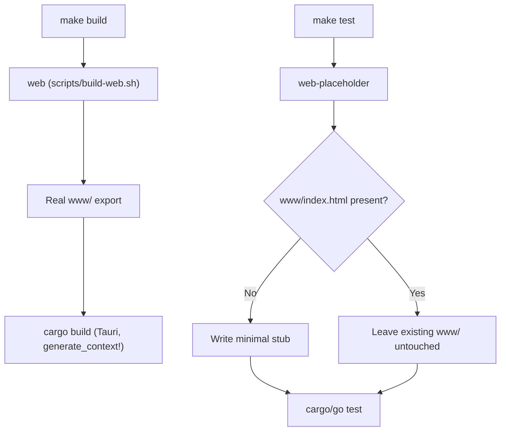

# Testing

> Registry combines a Rust/Tauri desktop shell with a Go-based backend and an embedded web frontend (`www/`). The active code-review rules for this repository describe the concrete build/test targets referenced below (`OPENFRAM-009-5`, `OPENFRAM-010-8`); no test source files, Go packages, or Rust modules were available to this document's material, so the sections below stay strictly within what those rules and the repository's CI workflows confirm.

## What this document covers

- How tests are organized in this repository given its Makefile-driven, multi-toolchain build
- How to run tests locally through the `make` targets the active rules require
- How to write new tests without breaking the frontend-embedding constraint the Tauri build imposes
- What coverage expectations apply, and how the automated code reviewer checks for missing tests

> The repository graph currently reports no indexed source files, test files, or symbols for this repository (coverage: full — meaning the absence is real, not a gap in indexing). This document is therefore scoped to the verifiable facts in the active code rules and CI workflow files rather than to specific test file paths, which are not yet visible in the graph.

## Test structure and organization

Registry's build has three layers that interact in a specific order, and this order is what shapes where tests can live and how they must be invoked:

1. **Web frontend (`www/`)** — a static export that the Tauri build embeds at Rust compile time via the `generate_context!` macro. The directory must physically exist before any Rust compilation step runs.
2. **Rust/Tauri shell** — compiled against whatever is currently staged in `www/`.
3. **Go backend** — built as a static binary (see Coverage requirements below for its build flags).

Because `generate_context!` embeds `www/` at compile time, every `make` target that triggers a Rust build — including `make lint` and `make test` — needs *something* in `www/index.html` before it can proceed, even when the target has nothing to do with the frontend. The Makefile resolves this with two distinct targets:

- `web` — runs `scripts/build-web.sh` to stage the **real** frontend export. This is the only target permitted ahead of `make build`.
- `web-placeholder` — writes a minimal stub into `www/` **only when `www/index.html` is absent** (using an `--if-missing` guard), so repeated runs don't clobber a real build. This is the only target permitted ahead of `make lint` and `make test`.



> **Rule OPENFRAM-009-5 (error severity):** `make build` must always depend on `web`, never on the placeholder. `make lint` and `make test` must always depend on `web-placeholder`, never on a real bundle build. Scripts must not call `npm run build:web` or `npm run web:placeholder` directly from any CI step that also runs `cargo build` — the Makefile targets are the single entry point. If you add a CI step or script that invokes cargo, go, or npm test/build commands directly, route it through the Makefile targets instead of duplicating the logic inline.

This means test organization in this repository is **not** simply "tests live next to source" — it is gated by which Makefile target stages `www/` first. Any new test suite (Go, Rust, or otherwise) that triggers a Tauri compile must run behind `web-placeholder`, not `web`, unless it is explicitly part of a release/build verification path.

## Running tests

Run tests through the Makefile targets that the active rules pin down:

```bash
# Stage the placeholder www/ export (only writes a stub if www/index.html is missing),
# then run the test suite behind it.
make test
```

A race-detector variant is called out explicitly in the active rules as the one sanctioned exception to the repository's default static-build flags:

```bash
# Race-detector build — the only target allowed to set CGO_ENABLED=1
make test-race
```

Do not invoke `npm run build:web`, `npm run web:placeholder`, `cargo build`, or `go test` directly in a CI step that also builds the Tauri shell — the Makefile targets (`web`, `web-placeholder`, `test`, `test-race`) are the single sanctioned entry point per `OPENFRAM-009-5`. Calling the underlying tools directly bypasses the guard that decides whether `www/` gets a real export or a placeholder, and can break the `generate_context!` embed step.

## Writing new tests

When adding or changing an exported definition (a function, type, or public API surface), the active deterministic rule `TEST-001` applies:

> **TEST-001 — "A new or changed exported definition should be referenced by a test"** (info severity, deterministic tier). A new or changed exported definition that no test file in the repository references ships unverified. Add or extend a test that exercises it, or state why it is not testable. This is checked by the `missing-test` analyzer over the checkout's test files using per-language test path globs; when the analyzer cannot run, it is judged from the diff.

Practical guidance that follows from this rule and from the build-ordering constraint above:

- **New Go or Rust code that is exported/public** should have an accompanying test that references it directly, so the deterministic `missing-test` analyzer can find the linkage. If a definition genuinely cannot be tested (e.g., a thin CLI entry point), state why in the pull request description rather than leaving it silently uncovered.
- **Tests that trigger a Rust compile** (anything exercised through `cargo test` or through the Tauri shell) must run after `web-placeholder`, never after a full `web` build, so that test runs stay fast and don't require a real frontend export.
- **Production build flags do not apply to test builds.** Per `OPENFRAM-010-8` (warn severity), production Go builds set `CGO_ENABLED=0` and `-trimpath` for fully static, reproducible binaries — but `test-race` is the explicitly sanctioned exception, and sets `CGO_ENABLED=1` because the race detector requires cgo. Do not carry `CGO_ENABLED=0` into a race-detector test target, and do not add `-trimpath` requirements to test-only builds.
- **Don't duplicate build/test logic in CI scripts.** If a new test path needs frontend assets staged, call the existing `web` or `web-placeholder` Makefile targets rather than re-implementing the npm invocation inline in a workflow step.

## Coverage requirements

There is no numeric coverage threshold recorded in this repository's active rule set. Coverage is enforced through two mechanisms instead:

1. **`TEST-001` (deterministic, info severity)** — every new or changed exported definition must be referenced by at least one test, checked automatically by the `missing-test` analyzer against the repository's test files. This is a per-change gate, not an aggregate percentage.
2. **Build-flag correctness for the paths tests exercise** — `OPENFRAM-010-8` (warn severity) requires production builds to use `CGO_ENABLED=0 -trimpath`, with `test-race` as the sole documented exception (`CGO_ENABLED=1`, for the race detector). A test target that silently drifts from these flags — for example, a new race-detection target that forgets to set `CGO_ENABLED=1`, or a non-test target that turns cgo back on — is a rule violation the automated reviewer will flag.

Because the code graph for this repository currently reports no indexed test files or symbols (coverage: full, meaning this is a confirmed empty state rather than a blind spot), no file-level or package-level coverage figures can be quoted here. Treat `TEST-001` compliance — every exported change backed by a referencing test — as the operative coverage bar until concrete test suites are indexed.

For related build and CI context, see the [Development overview](../README.md), the [environment setup guide](../setup/environment.md), and the [local development guide](../setup/local-development.md). Contribution requirements around this testing gate are covered in the [contributing guidelines](../contributing/guidelines.md).
