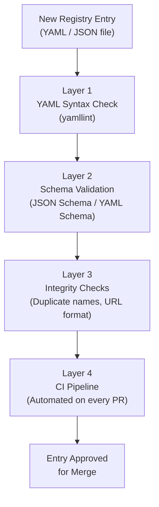
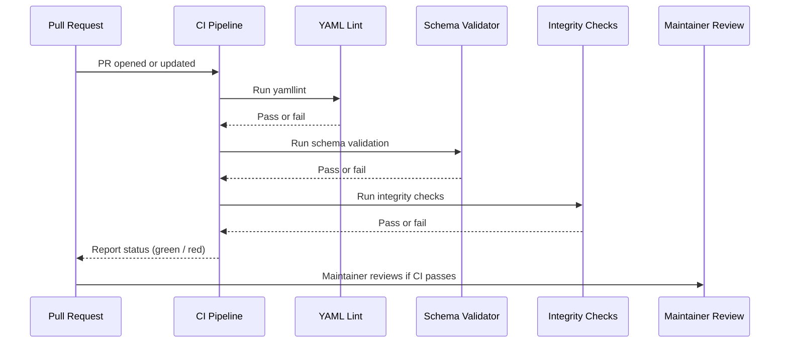

# Testing Overview

This document describes how to validate and test registry entries in the **Flamingo Registry**. Because the registry is a structured data catalog (not a compiled application), "testing" primarily means **schema validation, linting, and integrity checks**.

## What We Test

The Flamingo Registry uses a multi-layer validation approach:



| Test Layer | Tool | What It Checks |
|---|---|---|
| **YAML Syntax** | `yamllint` | Valid YAML syntax, indentation, trailing spaces |
| **Schema Validation** | JSON Schema validator | Required fields, correct types, valid enum values |
| **Integrity Checks** | Shell scripts / grep | No duplicate entry names, valid URL formats |
| **CI Pipeline** | GitHub Actions (or similar) | All of the above, run automatically on PRs |

---

## Running Tests Locally

Always validate your entries locally before pushing a PR. This catches errors early and speeds up the review process.

### Layer 1: YAML Syntax Validation

```bash
# Validate a single file
yamllint catalog/services/my-service.yaml

# Validate all catalog entries
yamllint catalog/

# Validate with verbose output
yamllint -v catalog/
```

**Passing output (no issues):** The command exits silently with code 0.

**Failing output example:**

```text
catalog/services/my-service.yaml
  5:3     error    wrong indentation: expected 4 but found 2  (indentation)
  12:1    warning  missing document start "---"  (document-start)
```

Fix any reported errors before proceeding.

### Layer 2: Schema Validation

If the repository includes a schema validation script:

```bash
# Check for available validation tooling
ls Makefile justfile scripts/ 2>/dev/null

# Run schema validation (adjust to the actual command in the repo)
make validate
# or
./scripts/validate.sh
```

If no automated script is available, you can use `ajv-cli` (a JSON Schema validator) manually:

```bash
# Install ajv-cli
npm install -g ajv-cli

# Validate a YAML file against a schema (convert to JSON first)
yq -o=json catalog/services/my-service.yaml > /tmp/my-service.json
ajv validate -s schemas/service.schema.json -d /tmp/my-service.json
```

### Layer 3: Integrity Checks

#### Check for Duplicate Entry Names

```bash
# Extract all entry names and find duplicates
grep -rh "^  name:" catalog/ | sort | uniq -d
```

If this command produces output, there are duplicate names — resolve them before committing.

#### Validate URL Format

```bash
# Find all URLs in catalog entries
grep -rh "https\?://" catalog/ | grep -oP "https?://[^\s'\"]+" | sort -u
```

Review the list to ensure all URLs are:
- Using HTTPS (not HTTP) where possible
- Pointing to publicly accessible endpoints
- Not containing embedded credentials or tokens

---

## Writing New Tests

As the registry grows, new validation rules may be added. When contributing a new check:

### Adding a Schema Constraint

Edit the relevant schema file in `schemas/`. For example, to require a new field `spec.homepage`:

```json
{
  "$schema": "http://json-schema.org/draft-07/schema#",
  "type": "object",
  "required": ["apiVersion", "kind", "metadata", "spec"],
  "properties": {
    "spec": {
      "type": "object",
      "required": ["homepage"],
      "properties": {
        "homepage": {
          "type": "string",
          "format": "uri"
        }
      }
    }
  }
}
```

After adding a schema constraint, update all existing entries in `catalog/` to comply with the new requirement.

### Adding a Shell-Based Integrity Check

If you're adding a new integrity check (e.g., enforcing a naming convention):

```bash
#!/usr/bin/env bash
# scripts/check-naming.sh
# Ensures all entry names use kebab-case

VIOLATIONS=$(grep -rh "^  name:" catalog/ | grep -vP "^  name: [a-z][a-z0-9-]+$")

if [ -n "$VIOLATIONS" ]; then
  echo "ERROR: The following entries have invalid names (must be kebab-case):"
  echo "$VIOLATIONS"
  exit 1
fi

echo "All entry names are valid."
```

Make the script executable:

```bash
chmod +x scripts/check-naming.sh
```

Add it to your CI pipeline configuration.

---

## CI Pipeline

The Flamingo Registry uses a CI pipeline (e.g., GitHub Actions) to run all validation checks automatically on every pull request.

### What the CI Pipeline Does



### CI Status

- **Green (passing)**: All validation layers passed — the PR is ready for maintainer review
- **Red (failing)**: One or more checks failed — the contributor must fix the issues before review

---

## Coverage Requirements

| Check | Requirement |
|---|---|
| YAML syntax validation | All files in `catalog/` must pass |
| Schema validation | All entries must conform to their `kind` schema |
| No duplicate names | Zero duplicates across the entire catalog |
| URL format | All `spec.homepage` and `spec.documentation` fields must be valid URIs |

---

## Troubleshooting Common Validation Failures

| Error | Likely Cause | Fix |
|---|---|---|
| `wrong indentation` | Tabs instead of spaces, or wrong indent size | Use 2-space indentation throughout |
| `missing document start "---"` | YAML file doesn't start with `---` | Add `---` as the first line |
| `required field missing` | Schema requires a field not present in the entry | Add the missing field |
| `format: uri` violation | A URL field has an invalid format | Ensure the URL starts with `https://` |
| `Duplicate name found` | Two entries share the same `metadata.name` | Rename one of the conflicting entries |

---

> For the contribution workflow after tests pass, see [Contributing Guidelines](../contributing/guidelines.md).
