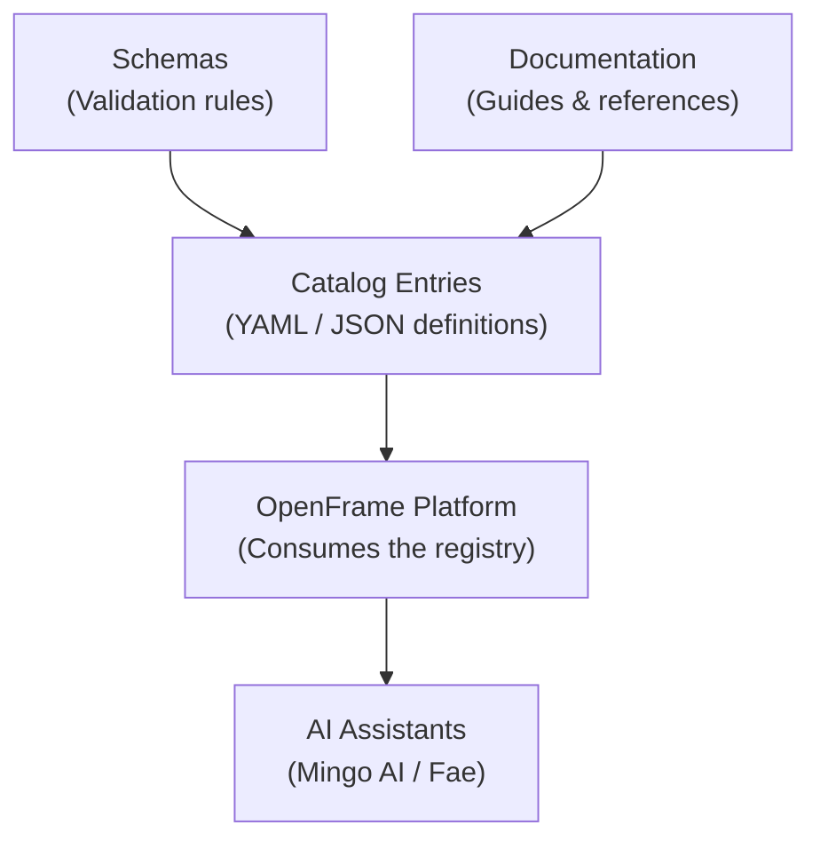

# First Steps

You've cloned the Flamingo Registry — here's what to do next. These five steps will help you understand the structure, configure your environment, explore the catalog, and connect with the community.

## Step 1: Understand the Registry's Purpose

The Flamingo Registry is the **service catalog for the OpenFrame MSP platform**. Before making changes, take a moment to understand what each part of the repository does:



| Section | What It Contains |
|---|---|
| `catalog/` | The registered services, integrations, and components |
| `schemas/` | JSON Schema or similar definitions that validate catalog entries |
| `docs/` | Documentation for contributors and platform operators |

## Step 2: Configure Your Editor

Set up your editor for the best experience working with registry files.

### VS Code (Recommended)

Install these extensions:

```text
- YAML (Red Hat) — YAML language support and schema validation
- Markdown All in One — Enhanced Markdown editing
- GitLens — Enhanced Git integration
- EditorConfig — Consistent file formatting
```

Associate schemas with registry files in your VS Code `settings.json`:

```json
{
  "yaml.schemas": {
    "./schemas/service.schema.json": "catalog/services/*.yaml",
    "./schemas/integration.schema.json": "catalog/integrations/*.yaml"
  }
}
```

> **Tip:** If the repository includes a `.editorconfig` or `.vscode/settings.json`, those settings will be picked up automatically.

## Step 3: Browse Existing Registry Entries

Get familiar with how the registry is structured by reading through existing entries:

```bash
# List all registered services
ls catalog/services/

# List all registered integrations
ls catalog/integrations/

# Read a specific entry
cat catalog/services/<entry-name>.yaml
```

Look for these key fields in each entry:

| Field | Description |
|---|---|
| `apiVersion` | The registry schema version (e.g., `registry.flamingo.run/v1`) |
| `kind` | Type of entry: `Service`, `Integration`, or `Component` |
| `metadata.name` | Unique identifier for the entry |
| `metadata.version` | Semantic version of the registered item |
| `spec` | Entry-specific configuration and metadata |

## Step 4: Validate a Registry Entry (If Schema Tools Are Available)

If the repository includes a validation script or schema files, validate your entries before committing:

```bash
# Example: using yamllint to check YAML syntax
yamllint catalog/services/my-service.yaml

# Example: using a JSON schema validator (if available in the repo)
# Adjust the command based on what tools the repo provides
```

> **Tip:** Check the repository's root directory for any `Makefile`, `justfile`, or shell scripts that may include a `validate` or `lint` target.

## Step 5: Connect with the Community

The Flamingo/OpenFrame community is active and welcoming. For questions, feedback, or collaboration:

- **OpenMSP Slack**: [https://www.openmsp.ai/](https://www.openmsp.ai/)
  - Join the Slack community for real-time help: [Invite Link](https://join.slack.com/t/openmsp/shared_invite/zt-36bl7mx0h-3~U2nFH6nqHqoTPXMaHEHA)
- **GitHub Repository**: [https://github.com/flamingo-stack/registry](https://github.com/flamingo-stack/registry)
  - Browse open pull requests and recent changes
- **Flamingo Platform**: [https://flamingo.run](https://flamingo.run)
- **OpenFrame Platform**: [https://openframe.ai](https://openframe.ai)

## Key Things to Explore

Now that you're set up, here are the most valuable areas to explore:

| Area | Why It Matters |
|---|---|
| Existing catalog entries | Understand conventions before adding your own |
| Schema definitions | Learn what fields are required vs. optional |
| Pull Request history | See how the community reviews registry changes |
| OpenFrame platform docs | Understand how registry entries are consumed |

## Common Questions

**Q: What makes a good registry entry?**
A: A good entry is accurate, complete, follows the schema, includes a meaningful description, and has up-to-date version information.

**Q: How quickly are PRs reviewed?**
A: The Flamingo Stack team reviews contributions on a best-effort basis. For faster feedback, post in the [OpenMSP Slack](https://www.openmsp.ai/).

**Q: Can I register a third-party tool integration?**
A: Yes! Third-party integrations are a key part of the registry's value. Follow the conventions in `catalog/integrations/` and submit a PR.

**Q: Where do I get help if I'm stuck?**
A: The [OpenMSP Slack community](https://www.openmsp.ai/) is the best place for real-time support.

---

> Ready to contribute? Head to the [Development section](../development/README.md) for a complete guide on contributing to the registry.
