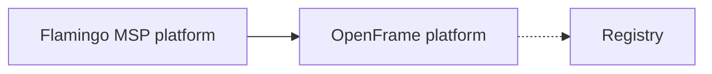

# Introduction

## What is Registry?

**Registry** ([flamingo-stack/registry](https://github.com/flamingo-stack/registry)) is a repository within the [Flamingo](https://flamingo.run) open-source ecosystem. Flamingo is an AI-powered MSP (Managed Service Provider) platform that replaces expensive proprietary tooling with open-source alternatives, enhanced by intelligent automation — Mingo AI for technicians and Fae for clients. At the center of that ecosystem sits [OpenFrame](https://openframe.ai) ([flamingo.run/openframe](https://www.flamingo.run/openframe)), the unified platform that brings multiple MSP tools together into a single AI-driven interface, automating IT support operations across the stack.

The repository graph currently has no published or consumed artifacts, upstream dependencies, or downstream consumers recorded for Registry, and no language, package manifest, or source files have been indexed yet. This document introduces the repository as it stands today and points you to the getting-started material available for setting up and contributing to it.

> **Note:** Detailed architecture, feature, and dependency documentation for Registry will expand as the codebase is indexed. Check back after future pipeline runs for deeper technical content.

## Key features and benefits

Because no source, manifest, or dependency data has been indexed for this repository yet, specific feature documentation cannot be asserted here without risking inaccurate claims. What can be said, grounded in the verified facts and the wider Flamingo/OpenFrame context:

- **Part of an open-source MSP stack** — Registry lives alongside the other repositories that make up Flamingo and OpenFrame, platforms built to displace costly proprietary MSP software with open alternatives.
- **AI-augmented operations context** — the broader platform it belongs to (OpenFrame) is designed to unify multiple MSP tools behind a single AI-driven interface, automating IT support workflows.
- **Community-driven** — support, discussion, and coordination for the project happen in the OpenMSP Slack community rather than through GitHub Issues or Discussions.

## Target audience

This repository, and the Flamingo/OpenFrame ecosystem it belongs to, is intended for:

- **Managed Service Providers (MSPs)** looking to replace proprietary tooling with open-source, AI-augmented alternatives.
- **IT technicians and support engineers** who will interact with AI-driven automation (Mingo AI) as part of daily operations.
- **Developers and contributors** who want to build, extend, or integrate with the Flamingo/OpenFrame platform.
- **Open-source community members** participating via the OpenMSP Slack community.

## Quick overview

The diagram below reflects the current, verified state of Registry in the organization's repository graph: a standalone node with no recorded upstream dependencies or downstream consumers yet indexed.

> The dotted edge indicates that no dependency relationship between Registry and OpenFrame has been recorded in the repository graph yet — it reflects the project's place in the broader Flamingo ecosystem narrative, not a confirmed code dependency.

## Getting started

To continue setting up and working with this repository, see:

- [Prerequisites](./prerequisites.md) — what you need before you begin.
- [Local Development](../development/setup/local-development.md) — how to run the project locally.
- [Development overview](../development/README.md) — general development workflow and practices.
- [Security](../development/security/README.md) — security practices and considerations.
- [Testing](../development/testing/README.md) — how to test changes.

## Community and support

This project does not use GitHub Issues or GitHub Discussions. All community support, questions, and discussion are managed through the OpenMSP Slack community:

- Website: [openmsp.ai](https://www.openmsp.ai/)
- Slack invite: [join.slack.com/t/openmsp](https://join.slack.com/t/openmsp/shared_invite/zt-36bl7mx0h-3~U2nFH6nqHqoTPXMaHEHA)
