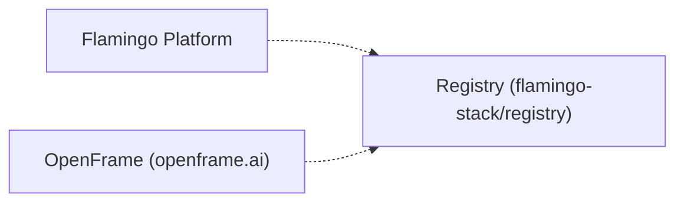

# Introduction

## What is Registry?

**Registry** (`flamingo-stack/registry`) is a repository within the [Flamingo Stack](https://flamingo.run) organization, the team behind [Flamingo](https://flamingo.run) — an AI-powered MSP (Managed Service Provider) platform that replaces expensive proprietary software with open-source alternatives enhanced by intelligent automation — and [OpenFrame](https://openframe.ai) ([flamingo.run/openframe](https://www.flamingo.run/openframe)), the unified platform that brings multiple MSP tools together under a single AI-driven interface to automate IT support operations across the stack.

At this stage, the repository graph has no recorded manifests, published artifacts, upstream dependencies, or downstream consumers for Registry: its role in the broader Flamingo/OpenFrame ecosystem is not yet established in the code graph. This document will be updated as the codebase and its integrations evolve. In the meantime, the sections below describe the intended shape of the getting-started documentation and how the repository fits into the wider organization.

> **Note:** No package manifests (`package.json`, `pom.xml`), setup scripts, or Docker Compose files were found in the indexed snapshot of this repository. Concrete setup and usage instructions will be added here once those materials are available.

## Key Features and Benefits

Key topics will include, as the codebase is analyzed further:

- How Registry fits into the Flamingo / OpenFrame ecosystem of tools
- The specific capability or service Registry provides to the platform
- Integration points with other Flamingo Stack repositories

Check back after the next pipeline run for complete content on features and benefits.

## Target Audience

This documentation is intended for:

- Engineers working within the Flamingo Stack organization who need to understand how Registry relates to Flamingo and OpenFrame
- Contributors evaluating or extending the Registry repository
- Operators and integrators who need a starting point before diving into setup, security, testing, and contribution details

## Quick Overview

The diagram below reflects the current, verified state of Registry in the organization's repository graph. No published artifacts, upstream dependencies, or downstream consumers have been recorded yet.

> Coverage for this graph is `full`: every other managed repository has a fresh snapshot, so the absence of upstream/downstream edges above reflects the actual current state, not a gap in analysis.

## Where to Go Next

To continue exploring how this repository is developed, tested, secured, and contributed to, see:

- [Development Overview](../development/README.md)
- [Testing Guide](../development/testing/README.md)
- [Security Guide](../development/security/README.md)
- [Contributing Guidelines](../development/contributing/guidelines.md)

For community support and discussion, the Flamingo Stack organization does not use GitHub Issues or GitHub Discussions. All community interaction happens on the OpenMSP Slack community, reachable via [openmsp.ai](https://www.openmsp.ai/).
