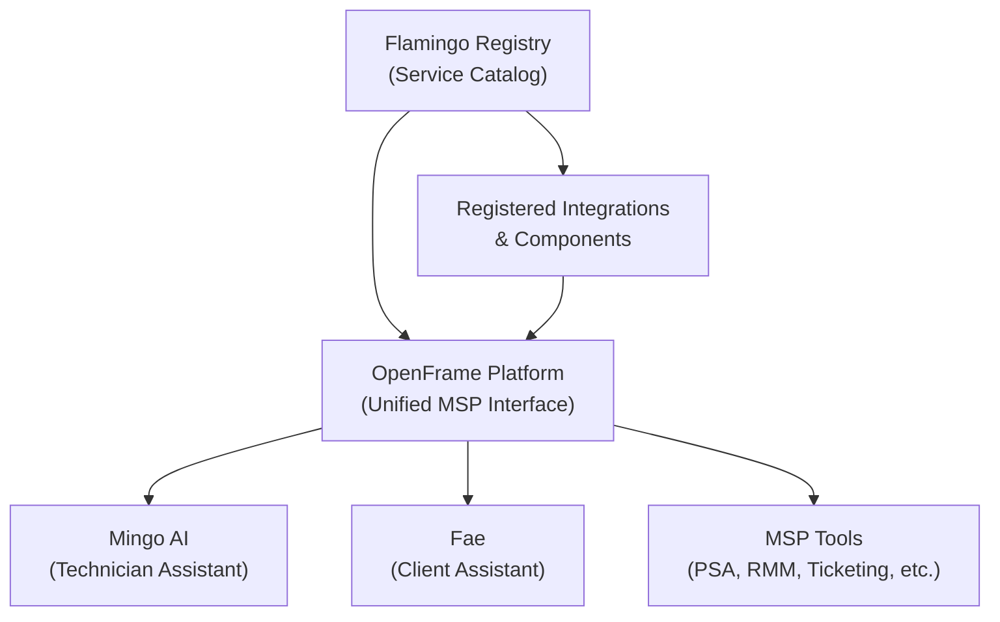
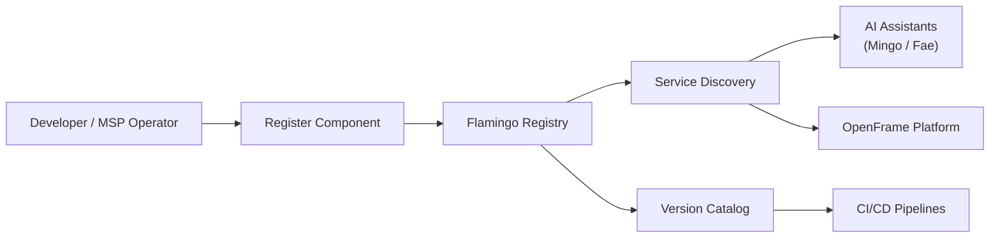

# Introduction to Flamingo Registry

Welcome to the **Flamingo Registry** — the central catalog and discovery hub for services, integrations, and components within the [Flamingo](https://flamingo.run) / [OpenFrame](https://openframe.ai) ecosystem.

## What Is the Flamingo Registry?

The Flamingo Registry is an open-source component of the OpenFrame platform that provides a **unified service directory** for MSP (Managed Service Provider) tooling. It acts as the source of truth for discovering, versioning, and referencing the building blocks that power AI-driven IT operations.

Think of it as the **package index and service catalog** for the OpenFrame ecosystem — enabling teams to:

- Register and discover platform services and integrations
- Maintain versioned catalogs of OpenFrame components
- Provide a machine-readable index for Mingo AI and Fae to resolve dependencies
- Support automated IT support workflows with a well-known service topology

## Key Features and Benefits

| Feature | Description |
|---|---|
| **Service Discovery** | Centralized lookup for all OpenFrame platform components |
| **Version Catalog** | Tracks releases and compatibility metadata for registered components |
| **Open Source** | Community-driven, extensible registry under the Flamingo Stack |
| **AI-Ready** | Designed for consumption by Mingo AI (technician assistant) and Fae (client assistant) |
| **MSP-Native** | Built for Managed Service Provider workflows and tooling patterns |
| **Integration Hub** | One place to register and reference third-party tool integrations |

## Who Is This For?

- **MSP Developers** building integrations on top of the OpenFrame platform
- **OpenFrame Operators** who manage service catalogs for their tenants
- **Contributors** extending the Flamingo ecosystem with new services or integrations
- **Platform Engineers** wiring together MSP tooling with AI automation

## Platform Context

The Registry is one component of the broader OpenFrame platform:

## Quick Overview

The Registry serves as the **spine of the OpenFrame service mesh** — every component that participates in the platform is registered here, making it discoverable, versionable, and auditable.

## Community and Support

- **OpenMSP Slack Community**: [https://www.openmsp.ai/](https://www.openmsp.ai/) — join the conversation, ask questions, and collaborate
- **Repository**: [https://github.com/flamingo-stack/registry](https://github.com/flamingo-stack/registry)
- **Flamingo Platform**: [https://flamingo.run](https://flamingo.run)
- **OpenFrame Platform**: [https://openframe.ai](https://openframe.ai)

## Getting Started

Ready to dive in? Continue with these guides:

- **[Prerequisites](prerequisites.md)** — Check what you need before getting started
- **[Quick Start](quick-start.md)** — Get up and running in minutes
- **[First Steps](first-steps.md)** — What to do right after setup
